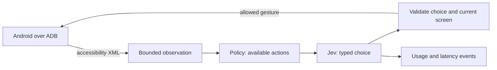

<div align="center">

# JevDroid

**A Python framework for controlling Android over ADB with Jev.**

Connect Android. Let Jev decide. Execute through ADB.

[](https://github.com/antiyro/jevdroid/actions/workflows/ci.yml)
[](pyproject.toml)
[](LICENSE)

[Quick start](#quick-start) · [Python API](#python-api) · [Architecture](docs/architecture.md) · [CLI](docs/cli.md) · [Contributing](CONTRIBUTING.md)

</div>

JevDroid connects [Jev](https://docs.typesafe.ai/introduction) to Android's control
layer. Your code gives it a goal and available capabilities; Jev reads the device
state and chooses an action; the framework translates that choice into Android
input over ADB. Read screens, open applications, tap elements, swipe, and navigate
back through a reusable Python SDK.

Use the full `run()` loop, or compose `observe()`, `decide()`, and `act()` in your
own application. Choose standard ADB commands or a persistent UIAutomator2 service
over ADB for faster observations. Application workflows live in your code, not
in the framework; multiple allowed packages can participate in the same task.

**Status: early alpha.** The original transport and Jev loop were exercised on a
physical Android phone. This is a foundation for experimentation, not a guarantee
of reliable operation across every Android app. See [limitations](#limitations).

## Measured speed and cost

Results from physical-device trials on a Samsung Galaxy A05 over USB, using Jev
through Vercel AI Gateway:

| Metric | Observed result |
| --- | --- |
| **Jev decision latency** | **390 ms median** · 343–519 ms across four scroll decisions |
| **Estimated cost per Jev decision** | **$0.000058 average** for those four decisions |
| **Estimated cost per 1,000 similar decisions** | **$0.058**, extrapolated at the same token usage and rate |
| **Android action execution** | **88 ms** to launch Settings · **170 ms** to tap a target |
| **Complete navigation task** | **6.57 s · $0.000307 estimated** · four decisions, two executed actions |

Decision latency measures the API call; action execution measures device input.
The full task includes observation, inference, validation, and execution. Costs
are input-token estimates at $0.042 per million tokens. These small samples were
collected with the POC; see [measurement details](docs/performance.md) for counts,
formulas, and the separate framework smoke checks.

## What ships

- **Jev-to-Android SDK.** `JevDroid.connect()` opens a session; `run()` handles a
  goal, while `decide()` and `act()` let your code control each step.
- **Python library and CLI.** Installable package, type hints, and replaceable
  `Device`, `Provider`, and event sink protocols.
- **Text-only observations.** No screenshots, OCR, or vision inference in the loop.
- **Two Android backends.** Standard platform-tools ADB, or persistent UIAutomator2
  over ADB. Both use the same model decisions and policies.
- **Persistent connections.** UIAutomator2 on Android and HTTP connection reuse for Jev.
- **Two Jev adapters.** TypeSafe directly or Vercel AI Gateway; no Node.js runtime.
- **Explicit capabilities.** Package allowlist; taps, back, and checkable elements
  require opt-in. Scroll tasks never offer taps.
- **Bounded runs.** Decision limits, exact gesture counts, repeated-state detection,
  payload caps, estimated cost reservation, and no automatic inference retries.
- **Useful measurements.** Separate UI, API, validation, and execution timings;
  optional metadata-only JSONL traces.
- **Offline development.** Deterministic demo and tests need neither a phone nor a key.

## Quick start

Requires Python 3.11+. Clone the repository; version 0.1.0 is not published to PyPI.

```bash
git clone https://github.com/antiyro/jevdroid.git
cd jevdroid
python -m venv .venv
source .venv/bin/activate
python -m pip install -e ".[android]"
jevdroid demo
```

On Windows, activate with `.venv\Scripts\activate` instead. `demo` is a scripted
simulation: it makes no network calls and is not a Jev performance benchmark.

For a real device, install
[Android platform-tools](https://developer.android.com/tools/releases/platform-tools),
enable USB debugging, authorize the computer, and unlock the phone. Connecting
through UIAutomator2 may install/start its automation service on the device.

```bash
jevdroid doctor
jevdroid inspect
jevdroid run "Open Display settings without changing a setting" \
  --package com.android.settings --allow-taps --budget 0.05
```

The CLI prompts for a hidden API key. It does not save the key. For noninteractive
use, supply `AI_GATEWAY_API_KEY` for Vercel (default), or `TYPESAFE_API_KEY` with
`--provider typesafe`. A funded account with access to Jev is required. Provider
rate limits and billing apply independently of JevDroid's local budget.

The visible UI text and goal are sent to the selected provider. `inspect` only
prints locally. Password-marked and invisible XML subtrees are excluded, but
arbitrary UI text can still contain private information.

## Python API

```python
import getpass
from decimal import Decimal

from jevdroid import JevDroid, Policy, RunConfig

with JevDroid.connect(
    api_key=getpass.getpass("Vercel key: "),
    backend="uiautomator",  # Use "adb" for standard platform-tools only.
    policy=Policy(("com.android.settings",), allow_taps=True),
    config=RunConfig(max_steps=12, budget_usd=Decimal("0.05")),
) as droid:
    result = droid.run("Open Display settings without changing a setting.")
    print(result.status, result.estimated_usd)
```

`model_done` means the model reported completion. It is
deliberately distinct from `completed`, which confirms the requested number of
scroll gestures was executed, not that each gesture loaded a new item.

### Control the loop yourself

Inside a connected session, separate the decision from device input:

```python
screen = droid.observe()  # ADB observation; no inference
plan = droid.decide("Open Display settings")  # Jev selects an action; no input yet
print(plan.action.kind, plan.action.description)
executed = droid.act(plan)  # Validate and execute once
```

Only the latest pending plan can execute, once. If the screen changed before a
tap, `act()` returns `False`. `DONE` and `STOP` also return `False` because they
issue no device input; inspect `plan.action.kind` to distinguish those cases.
Manual decisions share the session's budget and decision limit. Each `run()` has
its own limits. See the [SDK guide](docs/sdk.md) for lifecycle and extension points.

### Select an Android backend

| Backend | Implementation | Install | Use |
| --- | --- | --- | --- |
| `uiautomator` (default) | Persistent UIAutomator2 service reached through ADB | `pip install -e ".[android]"` | Fast interactive loops |
| `adb` | `adb shell uiautomator dump`, `input`, and `am` | `pip install -e .` | Standard ADB with no persistent service |

Both require authorized ADB access and Android platform-tools. The standard ADB
backend is slower because it starts an XML dump for each observation.

```bash
jevdroid run "Open Display settings" --package com.android.settings \
  --allow-taps --backend adb
```

### Bounded scrolling in any app

```bash
jevdroid scroll --package org.example.yourapp --count 5 --budget 0.05
```

Use the package name of an installed app. The provider chooses each launch and
swipe. The host stops after five executed gestures, even if the model would keep
going. This profile exposes no taps, back navigation, text input, likes, or follows.

[examples/scroll.py](examples/scroll.py) accepts any installed application's package
as its argument. Onboarding and login dialogs can stop the run.

### Inspect and measure

```bash
jevdroid benchmark --samples 10
jevdroid run "Open Display settings" --package com.android.settings \
  --allow-taps --trace traces/navigation.jsonl --json
```

Trace files contain action IDs, timings, token counts, cost estimates, and result
status. They do not include goals, UI text, device identifiers, or API keys.
Existing trace files are never overwritten.

## How it works



The model chooses an ID from host-generated actions. It cannot supply shell
commands, arbitrary coordinates, or new package names. Taps require a stable
screen and a fresh matching observation; swipes tolerate changing captions but
revalidate the foreground package. Observe-and-act is not atomic: see the
[execution boundaries](docs/architecture.md#execution-boundaries).

## Measure your own workload

Use `jevdroid benchmark` for device observation latency, and `--trace` to record
UI, Jev decision, validation, and Android execution times for a real task.
See [performance and cost accounting](docs/performance.md) for the exact boundaries
and per-decision cost calculations.

## Limitations

- Android only. Accessibility trees can be incomplete, stale, or unavailable in
  games, canvas interfaces, custom views, or permission overlays.
- No image understanding, text entry, arbitrary shell tools, or automatic login.
- A general navigation policy with taps can activate app controls. It does not
  infer or guarantee the business meaning of every button.
- Jev can choose the wrong permitted action or incorrectly claim success.
- Vercel's evaluation protocol is experimental. The adapter is isolated and
  contract-tested; upstream changes may require an update.
- Local cost estimates use a configurable input-token rate and a conservative
  reservation. They do not query your balance, include all possible fees, or
  enforce a provider-side spending cap.
- Sequential runner, one device per instance; no concurrent shared-device use.

## Development

```bash
python -m pip install -e ".[android,dev]"
ruff check .
ruff format --check .
mypy
pytest
python -m build
```

CI runs offline tests on Python 3.11–3.14 and checks formatting, typing, and package
builds. No device credentials belong in CI or this repository.

## License and credits

MIT. Independent community project; not affiliated with TypeSafe, Vercel, Google,
or TikTok. Built on [UIAutomator2](https://github.com/openatx/uiautomator2),
[HTTPX](https://www.python-httpx.org/), and
[defusedxml](https://github.com/tiran/defusedxml).
