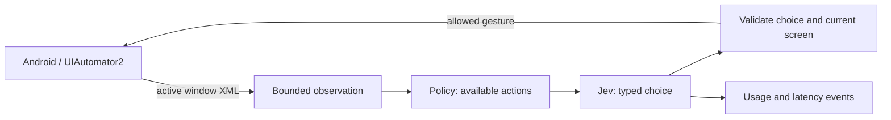

<div align="center">

# JevDroid

**Text-first Android agents powered by Jev.**

Read the interface. Choose a typed action. Execute within explicit limits.

[](https://github.com/antiyro/jevdroid/actions/workflows/ci.yml)
[](pyproject.toml)
[](LICENSE)

[Quick start](#quick-start) · [Python API](#python-api) · [Architecture](docs/architecture.md) · [CLI](docs/cli.md) · [Contributing](CONTRIBUTING.md)

</div>

JevDroid is a small, typed Python framework for building Android agents. It reads
the active accessibility tree over a persistent UIAutomator2 connection, asks
[Jev](https://docs.typesafe.ai/introduction) to choose from a finite set of actions,
and validates the choice before executing it.

Use it to build navigation assistants, bounded feed readers, and experiments with
decision models. Applications are selected by Android package name; the engine
has no app-specific selectors or TikTok-specific behavior.

**Status: early alpha.** The original transport and Jev loop were exercised on a
physical Android phone. This is a foundation for experimentation, not a guarantee
of reliable operation across every Android app. See [limitations](#limitations).

## What ships

- **Python library and CLI.** Installable package, type hints, and replaceable
  `Device`, `Provider`, and event sink protocols.
- **Text-only observations.** No screenshots, OCR, or vision inference in the loop.
- **Persistent connections.** UIAutomator2 on Android and HTTP connection reuse for Jev.
- **Two Jev adapters.** TypeSafe directly or Vercel AI Gateway; no Node.js runtime.
- **Explicit capabilities.** Package allowlist; taps, back, and checkable elements
  require opt-in. Scroll tasks never offer taps.
- **Bounded runs.** Decision limits, exact gesture counts, repeated-state detection,
  payload caps, estimated cost reservation, and no automatic inference retries.
- **Useful measurements.** Separate UI, API, validation, and execution timings;
  optional metadata-only JSONL traces.
- **Offline development.** Deterministic demo and tests need neither a phone nor a key.

## Quick start

Requires Python 3.11+. Clone the repository; version 0.1.0 is not published to PyPI.

```bash
git clone https://github.com/antiyro/jevdroid.git
cd jevdroid
python -m venv .venv
source .venv/bin/activate
python -m pip install -e ".[android]"
jevdroid demo
```

On Windows, activate with `.venv\Scripts\activate` instead. `demo` is a scripted
simulation: it makes no network calls and is not a Jev performance benchmark.

For a real device, install
[Android platform-tools](https://developer.android.com/tools/releases/platform-tools),
enable USB debugging, authorize the computer, and unlock the phone. Connecting
through UIAutomator2 may install/start its automation service on the device.

```bash
jevdroid doctor
jevdroid inspect
jevdroid run "Open Display settings without changing a setting" \
  --package com.android.settings --allow-taps --budget 0.05
```

The CLI prompts for a hidden API key. It does not save the key. For noninteractive
use, supply `AI_GATEWAY_API_KEY` for Vercel (default), or `TYPESAFE_API_KEY` with
`--provider typesafe`. A funded account with access to Jev is required. Provider
rate limits and billing apply independently of JevDroid's local budget.

The visible UI text and goal are sent to the selected provider. `inspect` only
prints locally. Password-marked and invisible XML subtrees are excluded, but
arbitrary UI text can still contain private information.

## Python API

```python
import getpass
from decimal import Decimal

from jevdroid import Agent, Policy, RunConfig
from jevdroid.android import AndroidDevice
from jevdroid.providers import JevProvider

with JevProvider(getpass.getpass("Vercel key: ")) as jev:
    agent = Agent(
        device=AndroidDevice(),
        provider=jev,
        policy=Policy(("com.android.settings",), allow_taps=True),
        config=RunConfig(max_steps=12, budget_usd=Decimal("0.05")),
    )
    result = agent.run("Open Display settings without changing a setting.")
    print(result.status, result.estimated_usd)
```

`model_done` means the model reported completion. It is
deliberately distinct from `completed`, which confirms the requested number of
scroll gestures was executed, not that each gesture loaded a new item.

### Bounded scrolling in any app

```bash
jevdroid scroll --package org.example.yourapp --count 5 --budget 0.05
```

Use the package name of an installed app. The provider chooses each launch and
swipe. The host stops after five executed gestures, even if the model would keep
going. This profile exposes no taps, back navigation, text input, likes, or follows.

[examples/scroll.py](examples/scroll.py) accepts any installed application's package
as its argument. Onboarding and login dialogs can stop the run.

### Inspect and measure

```bash
jevdroid benchmark --samples 10
jevdroid run "Open Display settings" --package com.android.settings \
  --allow-taps --trace traces/navigation.jsonl --json
```

Trace files contain action IDs, timings, token counts, cost estimates, and result
status. They do not include goals, UI text, device identifiers, or API keys.
Existing trace files are never overwritten.

## How it works



The model chooses an ID from host-generated actions. It cannot supply shell
commands, arbitrary coordinates, or new package names. Taps require a stable
screen and a fresh matching observation; swipes tolerate changing captions but
revalidate the foreground package. Observe-and-act is not atomic: see the
[execution boundaries](docs/architecture.md#execution-boundaries).

## Performance and language choice

Python keeps the device integration close to UIAutomator2's maintained client.
The measured POC spent its time in Android reads/transitions and remote inference,
so replacing the orchestration with Rust would not remove those waits.

On one Samsung Galaxy A05, the POC's persistent XML reads had a **229 ms median**
over ten samples, versus approximately **2.7 s** for cold ADB dumps. Four TikTok
scroll decisions took approximately **0.34–0.52 s each** at the API boundary.
These are historical observations, not framework benchmarks or throughput promises.
The fifth scroll was interrupted by a provider rate limit.

Measure your device with `jevdroid benchmark`. See [measurement methodology and
cost accounting](docs/performance.md) for the boundaries behind those numbers.

## Limitations

- Android only. Accessibility trees can be incomplete, stale, or unavailable in
  games, canvas interfaces, custom views, or permission overlays.
- No image understanding, text entry, arbitrary shell tools, or automatic login.
- A general navigation policy with taps can activate app controls. It does not
  infer or guarantee the business meaning of every button.
- Jev can choose the wrong permitted action or incorrectly claim success.
- Vercel's evaluation protocol is experimental. The adapter is isolated and
  contract-tested; upstream changes may require an update.
- Local cost estimates use a configurable input-token rate and a conservative
  reservation. They do not query your balance, include all possible fees, or
  enforce a provider-side spending cap.
- Sequential runner, one device per instance; no concurrent shared-device use.

## Development

```bash
python -m pip install -e ".[android,dev]"
ruff check .
ruff format --check .
mypy
pytest
python -m build
```

CI runs offline tests on Python 3.11–3.14 and checks formatting, typing, and package
builds. No device credentials belong in CI or this repository.

## License and credits

MIT. Independent community project; not affiliated with TypeSafe, Vercel, Google,
or TikTok. Built on [UIAutomator2](https://github.com/openatx/uiautomator2),
[HTTPX](https://www.python-httpx.org/), and
[defusedxml](https://github.com/tiran/defusedxml).
